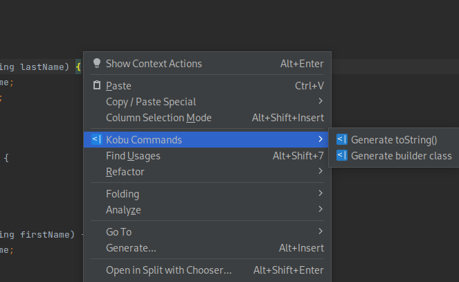

<p align="center">
    
</p>


[](https://github.com/kobuscript/kobu-interpreter/actions/workflows/ci-tests.yml)

Kobu is a domain-specific programming language for writing source code generators.

## Status

The interpreter and Intellij plugin are feature-complete, but I'm still working on proper automated tests, documentation
and examples. If you find any bugs or have some feedback, please open an issue.

## Motivation

Source code generators can be a valuable software development tool. They can abstract repetitive tasks and improve productivity, 
although they are often expensive to build and maintain.

Usually, a source code generator can be split into the following steps:

* **Data extraction**: The application reads data files (JSON, XML) or extracts data from the source code, 
such as annotated classes. For the latter, some languages provide tools 
for accessing metadata, but in some cases, you have to rely on parsers 
and ASTs (or shamefully use regex if you are in a hurry).
* **Data transformation**: The extracted metadata must be transformed and converted 
to a string (source code). You can use a template engine in simple cases, 
but usually, you have to deal with string manipulation.
* **File manipulation:** The final step is to write the generated source code to the disk. Writing new files 
or replacing existing ones is easy.  But if you need to edit existing files, like adding or replacing fields and 
methods in a class, this will probably be very painful.

To help with those tasks, Kobu offers the following features:

* **Codecs**: Built-in API for reading and writing CSV, XML, and JSON.
* **Parsers**: Built-in API for parsing Java files (future releases will also include support for TypeScript and Dart).
* **Rule engine and template processor**: Built-in rule engine with a powerful query syntax 
and integrated template processor.
* **Language commands**: Built-in API for editing Java files (future releases will also include support 
for TypeScript and Dart)

## Usage

The Kobu interpreter is a [single executable](https://github.com/kobuscript/kobu-interpreter/releases) 
(a Java program compiled with GraalVM's native image). It has the following features:

* **run**: Execute a Kobu script: `kobu run ./MyScript.kobu`
* **new**: create a new Kobu project: `kobu new my-new-project`
* **format**: Format a Kobu script (can also be triggered with the "Reformat Code" Intellij command).
* **cmd-list**: List all commands registered in the current project.
* **cmd**: Run a Kobu command

### Project definition

A project definition file (kobu.xml) is not required to run Kobu scripts but is helpful if your project
is composed of multiple files, or if you want to use the "Kobu commands" feature. When running "kobu new", a
kobu.xml file is created for you.

### Intellij plugin

The [Kobu Intellij plugin](https://github.com/kobuscript/kobu-intellij) can be used to write and invoke Kobu scripts. 
Any command registered in the project will be accessible directly from the editor's context menu. Example:

```XML
<commands>
    <command>
        <id>toString</id>
        <name>Generate toString()</name>
        <script>ToString.kobu</script>
        <description>Generate a toString() method for a Java class</description>
        <pattern>*.java</pattern>
    </command>
    <command>
        <id>Builder</id>
        <name>Generate builder class</name>
        <script>Builder.kobu</script>
        <description>Generate a Builder inner class for a Java class</description>
        <pattern>*.java</pattern>
    </command>
</commands>
```



## Language overview

Besides being a domain-specific language, Kobu has some features that are usually 
found only in general-purpose programming languages:

* **Type system**: Kobu is statically typed, with support for type inference. 
Records and global functions can have type parameters (generics)
* **Module system**: Your script can import other scripts. Global functions can be declared private.
* **Function as value**: Support for global and anonymous functions (closures). 
* **Data types**:
  * **Records**: Data-only classes with support for single inheritance.
  * **Arrays**: A sequence of elements of the same type. Supports literal notation (`var myArr = ["my", "array"]`), 
  slicing operator (`myArr[0:1]`) and transformation methods such as map(), flatMap(), filter() and reduce().
  * **Tuples**: A container with fixed number of elements, each with its own type: 
  `var myTuple: Tuple(number, string) = Tuple(1, "one")`

### Examples

Hello world:

```kobu
//file HelloWorld.kobu
module HelloWorld

fun main(): void {
    print("Hello world!");
}
```

Echo:

```kobu
//file Echo.kobu
module Echo

fun main(args: string[]): void {
    if (args.length() == 0) {
        return
    }
    print(args[0])
}
```

Cat (concat files to the standard output):

```kobu
//file Cat.kobu
module Cat

fun main(args: string[]): void {
    for (var in of args) {
        var file = File(Path([in]))
        print(file.read())
    }
}
```

JSON:

```kobu
//file Json.kobu
module Json

import dev.kobu.codec.Json

type record MyType {
    myAttr1: string,
    myAttr2: number,
    myAttr3: boolean,
    other: MyOtherType
}

type record MyOtherType {
    myAttr: string
}

fun main(): void {
    var myObj = MyType {
        myAttr1: "value",
        myAttr2: 10,
        other: MyOtherType {
            myAttr: "other value"
        }
    }

    print(toJson(myObj))
}
```

Java parser:
```kobu
//file JavaInterfaces.kobu
module JavaInterfaces

import dev.kobu.java.JavaParser
import dev.kobu.java.InputJavaTypes

//list all java interfaces of a source path
fun main(args: string[]): void {
    var dir = args[0]
    var javaFiles = parseJava(Path([dir]), "*.java", true)

    var interfaces = javaFiles
        .flatMap(file => file.definitions)
        .filter(javaDef => javaDef instanceof InputJavaInterface)
        .map(javaDef => javaDef.name)

    for (var interface of interfaces) {
        print(interface)
    }
    print("Total: " + interfaces.length())
    //pretty-print all java files
    //pprint(javaFiles)
}
```

## Rule engine

The rule engine system has two main components: the **working memory** and the **production memory**. 
The first is the set of data that needs to be processed, and the latter is the set of rules the system will execute.

In Kobu programs, the working memory is an array of records, and each record is recursively processed.

Each rule has a **query** and a **body**. The query can match records by type or path, 
and for each match, the body is executed.

Kobu has three types of rules:
  * **Rule**: The standard Kobu rule, is usually used to transform data and update the working memory.
  * **Template**: A rule that defines a template. When executed, it produces an object of `AnyTemplate` and inserts it 
in the working memory. It is possible to specify a sub-type of `AnyTemplate` to be used instead.
  * **Action**: Action rules are executed at the end of the process. They aren't allowed to update the working memory 
and usually perform file system operations, like file creation or update.

When initiated, the rule engine will first execute all standard rules until no new values are inserted in the 
working memory. Then, it will execute all template rules, and finally, the actions are executed.

### Example

Let's build a simple script that receives a CSV file and outputs an HTML table with the CSV content.

First, we will use the built-in API to read the CSV file:

```kobu
module CsvToHtml

import dev.kobu.codec.Csv

fun main(args: string[]): void {
    var csvFilePath = args[0]
    var csvFile = readCsvFile(csvFilePath)

    //TODO: start rule engine
}
```

Now, we can start writing our rules. For this example, we won't need any standard rules. 
Instead, we will use template rules to convert our CSV to HTML.

The `readCsvFile()` function returns a record of type `CsvFile`, which contains an array of `CsvRow`. 
Each `CsvRow` has an array of `CsvColumn`.

Let's start with columns. For each column, we will create a `td` tag:

```kobu
def template ColumnTemplate
             for CsvColumn as col <|
<td>${col.value}</td>
|>
```

A query can have four components: **selector**, **extractors**, **joins**, and **filter**, 
and only the first one is required. A selector is initiated by the `for` 
keyword and is responsible for selecting the records that will trigger the rule.
Here, we are selecting all records of type `CsvColumn`.

When executed, a template rule will produce an instance of `AnyTemplate` (or a sub-type of `AnyTemplate`, 
if specified) and insert it into the working memory. When a rule inserts a new value, 
we say that the record that triggered the rule owns this value. In that case, 
each `CsvColumn` will be the owner of an instance of `AnyTemplate`.

Now, there is an exception to that rule. If the column is from the first record, we need to produce a `<th>` tag instead. 
To do so, we will create another template that extends `ColumnTemplate`.

```kobu
def template ColumnHeaderTemplate extends ColumnTemplate
             for CsvFile / rows[0] / columns[*] as col <|
<th>${col.value}</th>
|>
```

When `RuleB` extends `RuleA`, we say that `RuleB` has a priority over `RuleA`, meaning that 
if a record triggers `RuleB`, it won't trigger `RuleA`.

Now, we need to create a template for each row:

```kobu
def template RowTemplate
             for CsvRow as row
             join AnyTemplate[] as colTmpl of row.columns <|
<tr>
    ${strJoin(colTmpl, "\n")}
</tr>
|>
```

Here, we select every instance of `CsvRow` and join every instance of `AnyTemplate`, which owner is a record 
referenced by the `CsvRow.columns` array. 

In the join expression, `AnyTemplate[]` is an accumulator, meaning that the rule won't be triggered
for each instance of AnyTemplate, but instead, they will be accumulated into a single array.

In this example, we can see another nice feature of Kobu: automatic indentation. 
By default, when we compose two templates, the inner one will be indented according 
to the insertion point of the outer one (that is, the position where the expression is inserted).

Let's write our final template:

```kobu
def template HtmlTemplate
             for CsvFile as file
             join AnyTemplate[] as rowsTmpl of file.rows <|
<!doctype html>
<html>
<head>
    <meta charset="UTF-8">
    <meta name="viewport" content="width=device-width, initial-scale=1.0">
</head>
<body>
    <table>
        <thead>
            ${rowsTmpl[0]}
        </thead>
        <tbody>
            ${strJoin(rowsTmpl[1:], "\n")}
        </tbody>
    <table>
</body>
</html>
|>
```

And finally, we can add an action rule that prints the generated HTML:

```kobu
def action PrintAction
           for CsvFile as file
           join AnyTemplate as htmlTemplate of file {
    print(htmlTemplate)
}
```

We can now change our `main()` function to configure our production and working memory:

```kobu
fun main(args: string[]): void {
    var csvFilePath = args[0]
    var csvFile = readCsvFile(csvFilePath)

    addRules([ColumnTemplate, ColumnHeaderTemplate, RowTemplate, HtmlTemplate, PrintAction])
    fireRules([csvFile])
}
```

This is our final script:

```kobu
module CsvToHtml

import dev.kobu.codec.Csv
import dev.kobu.functions.TemplateFunctions

def template ColumnTemplate
             for CsvColumn as col <|
<td>${col.value}</td>
|>

def template ColumnHeaderTemplate extends ColumnTemplate
             for CsvFile / rows[0] / columns[*] as col <|
<th>${col.value}</th>
|>

def template RowTemplate
             for CsvRow as row
             join AnyTemplate[] as colTmpl of row.columns <|
<tr>
    ${strJoin(colTmpl, "\n")}
</tr>
|>

def template HtmlTemplate
             for CsvFile as file
             join AnyTemplate[] as rowsTmpl of file.rows <|
<!doctype html>
<html>
<head>
    <meta charset="UTF-8">
    <meta name="viewport" content="width=device-width, initial-scale=1.0">
</head>
<body>
    <table>
        <thead>
            ${rowsTmpl[0]}
        </thead>
        <tbody>
            ${strJoin(rowsTmpl[1:], "\n")}
        </tbody>
    <table>
</body>
</html>
|>

def action PrintAction
           for CsvFile as file
           join AnyTemplate as htmlTemplate of file {
    print(htmlTemplate)
}

fun main(args: string[]): void {
    var csvFilePath = args[0]
    var csvFile = readCsvFile(csvFilePath)

    addRules([ColumnTemplate, ColumnHeaderTemplate, RowTemplate, HtmlTemplate, PrintAction])
    fireRules([csvFile])
}
```

## More examples

* **kobu-csv-processor-example**: [https://github.com/kobuscript/kobu-csv-processor-example](https://github.com/kobuscript/kobu-csv-processor-example)
* **kobu-java-example**: [https://github.com/kobuscript/kobu-java-example](https://github.com/kobuscript/kobu-java-example)

